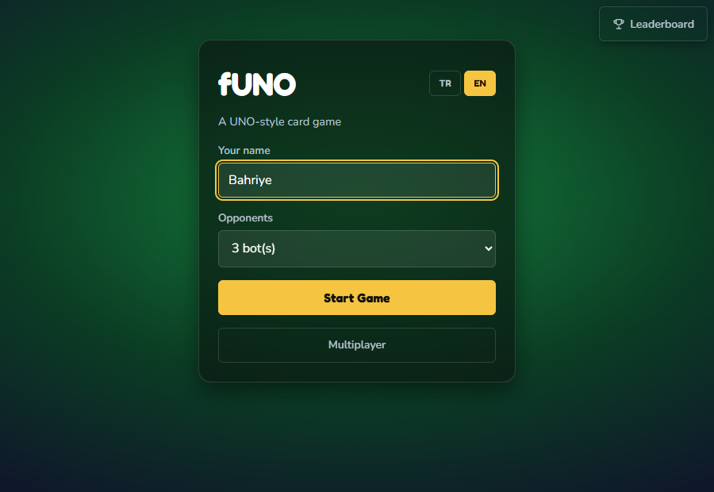
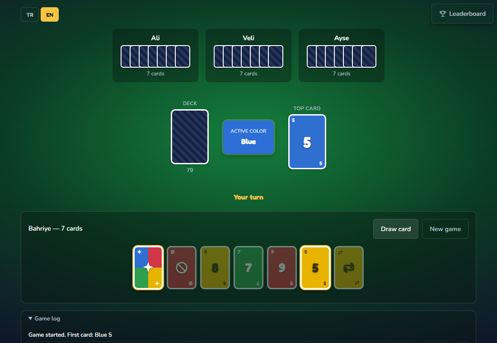
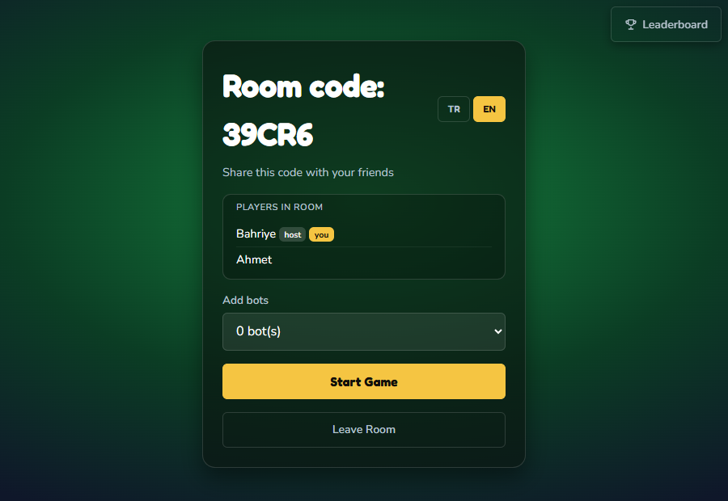
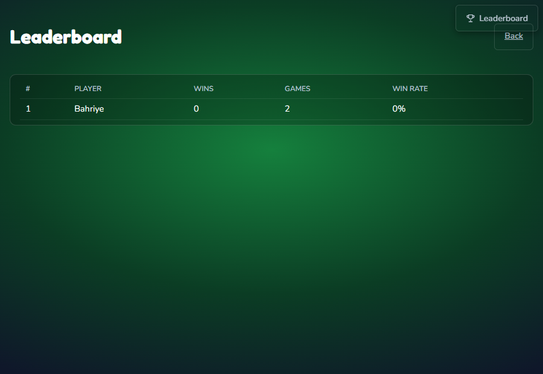

# fUNO

A UNO-style card game built in C# / .NET, developed as a term project for a
Software Project Management course. Supports both single-player (vs. bots)
and real-time multiplayer, with a bilingual (Turkish / English) interface.

> **Trademark note:** "UNO" is a registered trademark of Mattel. This project
> implements the same general card-matching mechanic under an original name
> and has no affiliation with Mattel or the official UNO brand.

## Screenshots

| Home screen | In-game (single-player) | Multiplayer lobby | Leaderboard |
|---|---|---|---|
|  |  |  |  |

## Table of contents

- [Features](#features)
- [Technology stack](#technology-stack)
- [Architecture](#architecture)
- [Game logic and rules](#game-logic-and-rules)
- [Project structure](#project-structure)
- [Getting started](#getting-started)
- [Testing](#testing)

## Features

- **Single-player mode** — play against 1–3 bots in the browser.
- **Multiplayer mode** — create a room, share a 5-character code, and play
  live against other people over SignalR. 2–6 players per room.
- **Disconnect handling** — if a player's connection drops mid-game, a bot
  automatically takes over their turns so the game never stalls. Reconnecting
  under the same name restores the player's seat and hand.
- **Bilingual UI (TR/EN)** — every player picks their own interface language
  independently; two players in the same room can each see the game in a
  different language at the same time. Game-log events are stored as
  structured entries (a key + arguments), not pre-rendered text, so they can
  be translated correctly for each viewer.
- **Bot opponents** — a simple rule-based bot that prioritizes action cards,
  saves wilds for last, and picks the color it holds the most of.
- **Full rule set** — standard 108-card deck, Skip / Reverse / Draw Two /
  Wild / Wild Draw Four, "UNO!" call with penalty enforcement, and
  configurable house rules (see below).
- **Accessible, responsive UI** — cards are drawn with plain CSS + SVG icons
  (no images, no emoji), 44px minimum touch targets, visible focus states,
  and `prefers-reduced-motion` support. Layout adapts down to 375px.
- **Leaderboard** — every finished game (single- or multiplayer) is recorded
  to a local SQLite database. Players are identified by the name they typed
  in — there are no accounts or passwords, matching how rooms already work.
  `/leaderboard` ranks players by wins.
- **Idle room cleanup** — a background service periodically sweeps empty,
  long-abandoned multiplayer rooms out of memory.

## Technology stack

| Layer | Technology |
|---|---|
| Language / runtime | C# 13, .NET 10 |
| Game engine | Plain C# class library (no framework dependencies) |
| Web UI | ASP.NET Core Blazor Web App, Interactive Server render mode |
| Real-time multiplayer | ASP.NET Core SignalR |
| Testing | xUnit |
| Styling | Hand-written CSS with design tokens (no CSS framework) |
| Fonts | Fredoka (display) / Nunito (UI text), via Google Fonts |
| Persistence | SQLite via EF Core, for match history / leaderboard only |

Active multiplayer rooms and in-progress game state still live in server
memory, not the database — only *finished* games are persisted.

## Architecture

The solution is split into independent layers with a strict dependency
direction: the game engine knows nothing about the UI, the network, or
persistence. Everything else depends on it — never the other way around.

```
Funo.Core            (rules engine, zero external dependencies)
   ^
   |
Funo.Web              (Blazor UI + SignalR, depends on Core)
   ^
   |
Funo.ConsoleSim       (bot-vs-bot simulator, depends on Core)
```

This means the entire rule set — every card interaction, every house rule,
every win condition — is unit-testable in complete isolation, with no web
server, browser, or network involved. `Funo.Core.Tests` does exactly that
(see [Testing](#testing)).

### Single-player flow

`GameSession` (scoped per browser connection) owns one `GameState` and
orchestrates turns: it lets the human play, then runs the bot loop until
control returns to the human or the game ends.

### Multiplayer flow

```
Browser  <--SignalR-->  GameHub  <-->  GameRoom  <-->  Funo.Core (GameEngine)
                            |
                       RoomManager (holds all active rooms)
```

- **`GameHub`** is the thin network boundary: it validates the caller has
  joined a room, forwards the intent (play a card, draw, call UNO, …) to the
  room, and pushes updated views back down. All game rules are enforced
  server-side — a tampered client cannot cheat.
- **`GameRoom`** holds the actual `GameState` for one match, guarded by a
  lock so concurrent requests from multiple players can't race each other.
  It also owns the bot-turn loop and disconnect/reconnect bookkeeping.
- **Per-player views, not one shared broadcast.** After every action, the
  hub builds a separate `GameView` for *each* connected player and sends it
  only to them. Opponents' hands are only ever exposed as a card *count* —
  the actual `Card` list for other players never leaves the server. This is
  deliberate: broadcasting one shared state object to the whole room would
  leak every player's hand to every other player.

### Localization

`Funo.Core` never produces user-facing text — only stable message keys
(`EngineMessages`). The web layer's `Strings` table maps every key to
Turkish and English text, and structured `LogEntry` records (key + args,
where args can themselves be translatable tokens like a card or a color)
are translated at render time in the viewer's own chosen language
(`LanguageState`, a scoped service). That's what allows one multiplayer
match to show TR to one player and EN to another simultaneously.

## Game logic and rules

Real-world UNO has several house-rule variations. Rather than leaving that
implicit, every one of them is pinned down explicitly in `GameOptions`:

| Rule | Decision | Option |
|---|---|---|
| Starting hand size | 7 cards | `StartingHandSize` |
| Stack a Draw Two on a Draw Two? | Yes | `StackDrawTwo` |
| Stack a Wild Draw Four on a Wild Draw Four? | No | `StackDrawFour` |
| Play a card immediately after drawing it, if playable? | Yes | `PlayDrawnCard` |
| Penalty for forgetting to call "UNO!" | 2 cards | `EnforceUnoCall`, `UnoPenaltyCards` |
| Reverse in a 2-player game | Acts like a Skip | `ReverseActsAsSkipInTwoPlayerGame` |

Simplification: the opening card is redrawn until it's a plain number card,
so the game never starts off with an action-card effect already in play.

### Deck composition

Standard 108-card deck: 4 colors × (one 0, two each of 1–9, two each of
Skip / Reverse / Draw Two) = 100 colored cards, plus 4 Wild and 4 Wild Draw
Four cards.

### Turn resolution (`GameEngine`)

`GameEngine` is a static, stateless class — it takes a `GameState` and
mutates it according to the rules, and never holds any state itself. Key
entry points:

- `CanPlay` — is a given card legal on top of the current pile?
- `PlayCard` — plays a card, applies its effect (skip / reverse / stack a
  penalty / require a wild color), checks for a win, and enforces the UNO
  penalty.
- `DrawCard` — draws either the pending penalty stack or a single card, and
  advances the turn unless the drawn card is immediately playable.
- `CallUno` — only valid with exactly two cards in hand.

When the draw pile runs out, the discard pile (minus its top card) is
reshuffled back into a new draw pile — verified up to full-deck depletion
in `DeckTests`.

## Project structure

```
src/
  Funo.Core/                Rules engine — no UI, no network, 100% unit-testable
    Model/                  Card, Deck, Player, GameState, GameOptions
    Engine/                 GameEngine (rule logic), EngineMessages, PlayResult
    Ai/                     SimpleBot (bot strategy)

  Funo.Web/                 Blazor Web App (Interactive Server)
    Services/GameSession    Single-player turn orchestration
    Rooms/                  GameRoom, RoomManager, RoomCleanupService
    Hubs/GameHub            SignalR entry point
    Contracts/GameView      Per-player network-safe view + CardDto
    Localization/           Strings (TR/EN table), LanguageState, LogEntry
    Data/                   FunoDbContext, Match/MatchSeat, MatchRecorder (SQLite)
    Components/Game/        CardView (cards are drawn entirely in CSS + SVG)
    Components/Pages/       Game.razor (single-player), Multiplayer.razor,
                             Leaderboard.razor

  Funo.ConsoleSim/          Headless bot-vs-bot simulator (Sprint 1 tool)

tests/
  Funo.Core.Tests/          Engine unit + full-game integration tests
  Funo.Web.Tests/           GameRoom, RoomManager, localization tests
```

## Getting started

Requires the .NET 10 SDK.

Clone and restore:

```bash
dotnet restore
```

Run the web app (opens on `http://localhost:5193`):

```bash
dotnet run --project src/Funo.Web --launch-profile http
```

Open the URL in two different browser windows (or one normal + one private
window) to try multiplayer locally: create a room in one, join with the
code shown in the other.

A `funo.db` SQLite file is created automatically next to the project on
first run (and gitignored) — no separate database setup is needed.

Run the headless bot simulator (4 bots play a complete game to the console):

```bash
dotnet run --project src/Funo.ConsoleSim
```

Pass a seed to reproduce the exact same shuffle and game:

```bash
dotnet run --project src/Funo.ConsoleSim -- 42
```

> **Note:** `dotnet run` does not hot-reload. After editing a `.razor` or
> `.cs` file, restart the server (or use `dotnet watch run` instead), or the
> browser will stay connected to stale server code.

## Testing

```bash
dotnet test
```

79 tests, all passing:

- **`Funo.Core.Tests`** (42 tests) — deck composition and shuffling, every
  card-matching rule, turn/direction/penalty-stacking behavior, UNO-call
  penalties and scoring, plus a randomized integration suite that plays
  100+ complete games per player count (2, 3, 4, 6 players) and asserts the
  card count always stays conserved at 108 and every game finishes without
  deadlocking.
- **`Funo.Web.Tests`** (37 tests) — room join/leave/reconnect rules, host
  transfer, start-game validation, turn/draw/UNO-call error paths, the
  guarantee that a broadcast view never exposes another player's hand
  contents, a full game that finishes when a human disconnects and bots
  take over (driven one bot-turn at a time, matching how the server paces
  moves for real players), and the TR/EN translation table (including that
  log arguments like card names are translated per viewer, not baked into
  the stored log).
